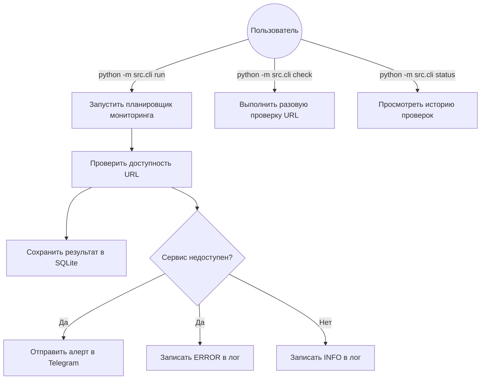

# Отчет по Контрольной точке №1: Проектирование и Старт
**Название проекта:** HealthChecker — микросервис распределённого мониторинга API-эндпоинтов  
**Команда / Разработчик:** Романовский Михаил Владимирович

### 1. Архитектурный план и концепция
* **Цель сервиса:** Микросервис периодически опрашивает заданный список URL-адресов, проверяет их доступность, статус-коды, время ответа и валидность SSL-сертификатов. При обнаружении сбоя или истечении срока SSL сервис отправляет уведомление в Telegram-бот и фиксирует инцидент в структурированный лог-файл.
* **Целевой интерфейс:** CLI (Click) + фоновый сервис-планировщик (APScheduler)
* **Выбранный стек:** Python 3.11, httpx, APScheduler, Click, Loguru, SQLite + aiosqlite, python-telegram-bot, Flake8 + Black, Docker + docker-compose

### 2. Проектирование (UML-диаграммы)

**Диаграмма вариантов использования (Use Case):**



**Диаграмма последовательности (Sequence) взаимодействия модулей:**

```mermaid
sequenceDiagram
    participant CLI as cli.py
    participant SCH as scheduler.py
    participant CHK as checker.py
    participant REP as repository.py
    participant ALT as alert_service.py
    participant NOT as notifier.py
    participant LOG as logger.py

    CLI->>SCH: start(config)
    loop Каждые N секунд
        SCH->>CHK: check_url(url, timeout)
        CHK-->>SCH: CheckResult(status, latency, ssl_days)
        SCH->>LOG: info / error (результат)
        SCH->>REP: save(CheckResult)
        SCH->>ALT: evaluate(CheckResult)
        alt Сервис недоступен
            ALT->>NOT: send_alert(url, reason)
            NOT-->>ALT: OK
            ALT->>LOG: warning("Alert sent")
        end
    end
```

### 3. Распределение ролей
*Индивидуальная разработка — распределение ролей не применяется.*

### 4. Чек-лист готовности (Заполняется студентом: [x] — готово, [ ] — нет)
* [x] Создан новый публичный репозиторий на GitHub.
* [x] Все участники добавлены в репозиторий как соавторы (Collaborators).
* [x] Каждый участник сделал минимум 3 осмысленных коммита (согласно Git-политике).
* [x] Настроено локальное виртуальное окружение, проект запускается в базовом виде.
